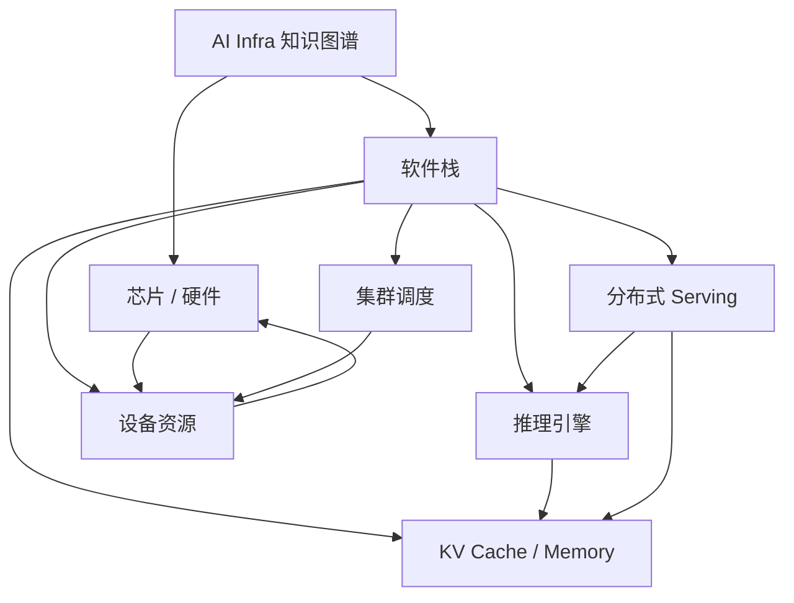

# AI Infra 知识图谱入口

这是 Obsidian 中推荐的全仓库根节点。把仓库根目录直接作为 Obsidian Vault 后，可通过 Wiki Link、Backlinks、Local Graph 和 Graph View 观察硬件、软件、调度、KV Cache 与分布式推理之间的关系。

## 主要入口

- [[chip/00-project-index|AI 芯片与基础设施资料库]]
- [[software/README|AI Infra 软件栈地图]]
- [[AGENTS|协作约定与知识图谱规则]]

## 核心软件概念节点

- [[software/concepts/llm-serving-stack|LLM Serving 软件栈]]
- [[software/concepts/pd-disaggregation|Prefill / Decode 分离]]
- [[software/concepts/kv-cache-lifecycle|KV Cache 生命周期]]
- [[software/concepts/topology-aware-scheduling|拓扑感知调度]]
- [[software/concepts/accelerator-resource-model|加速器资源模型]]
- [[software/concepts/heterogeneous-inference|异构推理]]

## 关系总览

## 建图原则

内部关系优先使用 `[[vault/root/path|显示名]]`。外部资料继续使用普通 URL。不要为了让图更密而机械互链，应围绕真实架构关系建立边，并用 MOC 和概念节点连接不同目录。

新增或重构文档时，先判断它属于哪个领域入口，再补充它与上下游组件、关键机制和硬件层的关系。具体规则见 [[AGENTS#Obsidian 知识图谱与内部链接|AGENTS.md 的 Obsidian 规范]]。
