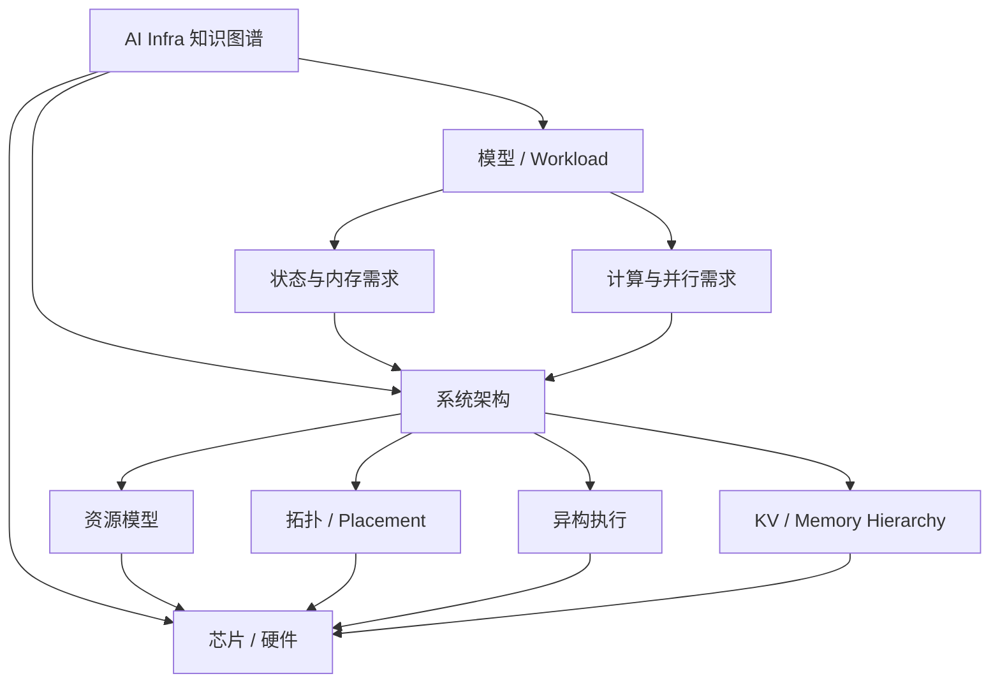

# AI Infra 知识图谱入口

这是 Obsidian 中推荐的全仓库根节点，也是在线知识图谱站点的逻辑首页。当前知识组织围绕 **Model → System → Chip**：从模型架构产生的计算、状态与通信需求出发，经系统层映射到内存层级、资源表达、拓扑和异构执行，最终落到芯片、内存、互联与基础设施事实。

## 在线知识图谱

- Quartz 知识库：https://MarsChan8293.github.io/ai_infra_docs/
- 关系探索器：https://MarsChan8293.github.io/ai_infra_docs/graph-explorer/

关系探索器自动扫描仓库 Markdown，把文档作为节点、内部 Wiki Link / 本地 Markdown Link 作为边，并按 `models`、`system`、`chip` 与根级文档分域。

## 主要入口

- [[models/00-model-index|AI Model Index]]
- [[system/README|AI Infra 系统架构]]
- [[chip/00-project-index|AI 芯片与基础设施资料库]]
- [[AGENTS|协作约定与知识图谱规则]]

## 核心系统概念

- [[system/memory/kv-cache-memory-hierarchy|KV Cache 内存层级]]
- [[system/resource/accelerator-resource-model|加速器资源模型]]
- [[system/scheduling/topology-aware-scheduling|拓扑感知调度]]
- [[system/heterogeneous-compute/heterogeneous-inference|异构推理]]

## 关系总览

## 软件边界

软件项目、社区、能力、集成与维护者关系不再在本仓库维护第二份事实。需要引用软件项目时，直接链接 [ai_infra_relationship](https://github.com/MarsChan8293/ai_infra_relationship) 中的 canonical 页面。

## 建图原则

内部关系优先使用 `[[vault/root/path|显示名]]`。外部资料继续使用普通 URL。MOC 负责“有哪些节点”，系统概念页负责“为什么模型与硬件有关”，不要为了让图更密而机械互链。

图谱的源数据始终是 Markdown 本身，不单独维护一份手工关系数据库。新增或重构文档时，优先判断它属于 Model、System 还是 Chip，再补充真实的上下游关系。
