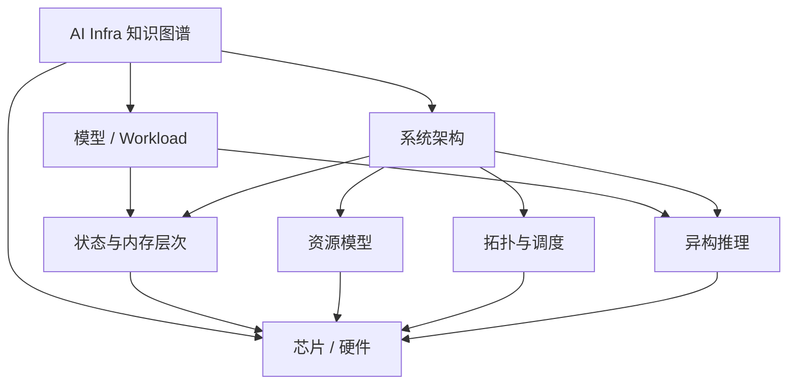

# AI Infra 知识图谱入口

这是 Obsidian 中推荐的全仓库根节点，也是在线知识图谱站点的逻辑首页。仓库的主轴是 **Model → System → Chip**：模型定义 workload 与状态规模，系统层解释这些需求如何映射到内存、拓扑、资源与异构计算，芯片层保存硬件事实。

## 在线知识图谱

- Quartz 知识库：https://MarsChan8293.github.io/ai_infra_docs/
- 关系探索器：https://MarsChan8293.github.io/ai_infra_docs/graph-explorer/

关系探索器会自动扫描仓库 Markdown，把文档作为节点、内部 Wiki Link / 本地 Markdown Link 作为边，并按 `models`、`system`、`chip` 与根级文档分域。

## 主要入口

- [[models/00-model-index|AI Model Index]]
- [[system/README|AI Infra System Architecture]]
- [[chip/00-project-index|AI 芯片与基础设施资料库]]
- [[AGENTS|协作约定与知识图谱规则]]

## 核心系统节点

- [[system/memory/kv-cache-memory-hierarchy|KV Cache 内存层次]]
- [[system/resource/accelerator-resource-model|加速器资源模型]]
- [[system/topology/topology-aware-scheduling|拓扑感知调度]]
- [[system/heterogeneous-compute/heterogeneous-inference|异构推理]]

## 关系总览

## 软件项目边界

软件项目、社区、能力、集成和维护者关系的 canonical 事实维护在 [ai_infra_relationship](https://github.com/MarsChan8293/ai_infra_relationship)。本仓库不再维护本地软件项目页；需要引用软件时使用 relationship canonical URL 或官方上游 URL。

## 建图原则

内部关系优先使用 `[[vault/root/path|显示名]]`。外部项目和官方资料继续使用普通 URL。不要为了让图更密而机械互链，应围绕真实的 workload、系统机制与硬件约束建立边。
