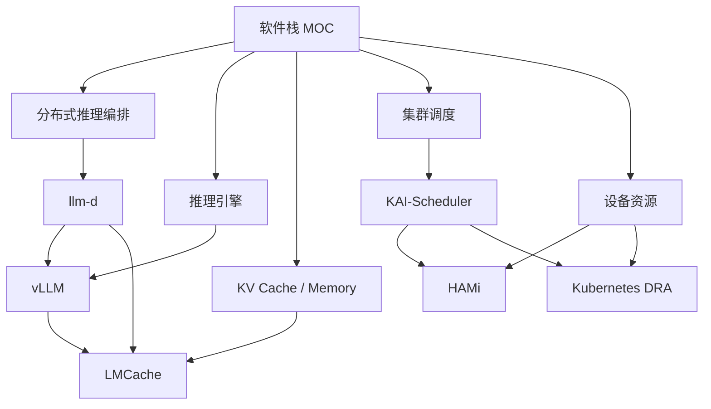

# AI Infra 软件栈地图

上级入口：[[00-ai-infra-map|AI Infra 知识图谱入口]]

本目录按架构层级整理 AI Infra 相关软件，而不是按项目名平铺。目标是形成一个可持续扩展的软件知识图谱：每个软件都要说明它解决哪一层问题、边界在哪里、和上下游如何集成、对大模型推理性能有什么影响。

## Obsidian 关系导航

这一组概念页是软件文档之间的“桥梁节点”，用于在 Graph View 中观察跨层关系，而不是让所有项目文档彼此机械互链。

- [[software/concepts/llm-serving-stack|LLM Serving 软件栈]]：总览请求路由、推理引擎、KV、调度和设备资源层。
- [[software/concepts/pd-disaggregation|Prefill / Decode 分离]]：连接 serving、推理引擎、KV 传输和网络。
- [[software/concepts/kv-cache-lifecycle|KV Cache 生命周期]]：连接生成、驻留、复用、迁移、卸载和淘汰。
- [[software/concepts/topology-aware-scheduling|拓扑感知调度]]：连接 NUMA、PCIe、NVLink、NIC 与 workload placement。
- [[software/concepts/accelerator-resource-model|加速器资源模型]]：连接 DRA、HAMi、调度器与真实设备属性。
- [[software/concepts/heterogeneous-inference|异构推理]]：连接模型画像、Benchmark、SLA 与不同 GPU/NPU。

硬件侧入口：[[chip/00-project-index|AI 芯片与基础设施资料库]]。

## 分层总览

```text
应用 / API / Agent / RAG
        │
        ▼
分布式推理编排 / 请求路由
llm-d / NVIDIA Dynamo / KServe / Ray Serve
        │
        ▼
推理引擎 / 模型执行
vLLM / SGLang / TensorRT-LLM / vLLM-Ascend
        │
        ▼
KV Cache / 内存与传输层
LMCache / Mooncake / NIXL / GDS / Redis / S3
        │
        ▼
集群调度层
KAI-Scheduler / Volcano / Kueue / kube-scheduler
        │
        ▼
设备资源 / 虚拟化 / 拓扑抽象
HAMi / Kubernetes DRA / Device Plugin / GPU Operator
        │
        ▼
GPU / NPU / RDMA NIC / PCIe / NVLink / HBM / CPU Memory
```



这张图不是严格的烟囱结构。现实里的软件常常跨层：[[software/inference-engine/vllm|vLLM]] 既是推理引擎，也带请求调度和 KV 管理；[[software/kv-cache/lmcache|LMCache]] 既做 KV 存储，也参与 P/D 分离传输；[[software/distributed-serving/llm-d|llm-d]] 既做请求级路由，也需要理解 KV 命中和后端拓扑；[[software/device-resource/hami|HAMi]] 既做设备插件，也带调度扩展能力。因此每个文档都要同时记录“主战场”和“越界能力”。

## 当前目录

### 1. 推理引擎：`inference-engine/`

推理引擎负责真正执行模型 forward，把 prompt 和 KV cache 转换成 token 输出。重点关注 CUDA/NPU kernel、batching、attention、MoE、并行策略、显存管理和服务接口。

- [[software/inference-engine/vllm|vLLM]]

后续建议新增：SGLang、TensorRT-LLM、vLLM-Ascend、MindIE、DeepSeek Harness。

### 2. KV Cache / 内存系统：`kv-cache/`

这一层负责 KV cache 的存储、复用、卸载、传输和可观测性。它直接影响长上下文、多轮对话、RAG、Agent 工作负载的 TTFT、GPU 利用率和网络压力。

- [[software/kv-cache/lmcache|LMCache]]

后续建议新增：Mooncake、NIXL、GDS、InfiniStore、Redis/Valkey KV 后端、客户端 KV cache 设计。

### 3. 分布式推理编排：`distributed-serving/`

这一层位于单个推理引擎之上，负责把多个 worker 组织成一个 LLM 服务。关注请求路由、P/D 分离、KV-aware routing、异构 worker 池、灰度发布、故障恢复和多租户服务治理。

- [[software/distributed-serving/llm-d|llm-d]]

后续建议新增：NVIDIA Dynamo、KServe、Ray Serve、BentoML、KServe + vLLM 组合方案。

### 4. 集群调度层：`scheduling/`

调度层决定 Pod、Job、训练任务或推理实例应该落在哪些节点上。它关注队列、配额、公平性、Gang Scheduling、抢占、优先级、拓扑感知和异构资源池。

- [[software/scheduling/kai-scheduler|KAI-Scheduler]]

后续建议新增：Volcano、Kueue、Slurm on Kubernetes、Ray Scheduler。

### 5. 设备资源 / 虚拟化：`device-resource/`

这一层接近硬件和 Kubernetes 设备模型，负责把 GPU/NPU/RDMA 等资源暴露给容器，并处理共享、隔离、拓扑、健康状态和跨厂商抽象。

- [[software/device-resource/hami|HAMi]]
- [[software/device-resource/dra|Kubernetes DRA]]

后续建议新增：NVIDIA GPU Operator、NVIDIA Device Plugin、Ascend Device Plugin、Intel Gaudi Device Plugin、AMD ROCm Device Plugin。

## 典型组合路径

### 单机高吞吐在线推理

```text
API Server
  → vLLM
  → GPU / NPU
```

适合模型可放入单机或单组 GPU、请求前缀复用不强、重点是 continuous batching 和 kernel 性能的场景。对应节点：[[software/inference-engine/vllm|vLLM]]。

### 长上下文 / 多轮会话 / RAG

```text
API Server
  → vLLM
  → LMCache
  → CPU RAM / SSD / Remote Cache
```

适合长 system prompt、多轮会话、知识库检索后重复上下文较多的场景。核心收益来自减少重复 prefill，核心风险来自 KV 传输、序列化和 cache 命中率不足。参见 [[software/concepts/kv-cache-lifecycle|KV Cache 生命周期]]。

### P/D 分离推理

```text
Router / llm-d
  → Prefill Worker Pool
  → KV Transfer: NIXL / RDMA / NVLink / TCP
  → Decode Worker Pool
```

适合长输入短输出、prefill compute-bound 与 decode memory-bound 差异明显的场景。核心难点是请求编排、KV cache 传输、worker 失效处理和网络带宽。参见 [[software/concepts/pd-disaggregation|Prefill / Decode 分离]]。

### Kubernetes 多租户 AI 集群

```text
用户 / 队列 / 项目
  → KAI-Scheduler / Volcano / Kueue
  → HAMi / DRA / Device Plugin
  → GPU / NPU 节点
```

适合多个团队共享 GPU/NPU 集群，要求配额、公平性、抢占、GPU sharing 和拓扑感知的场景。参见 [[software/concepts/accelerator-resource-model|加速器资源模型]] 与 [[software/concepts/topology-aware-scheduling|拓扑感知调度]]。

### 异构 GPU/NPU 推理平台

```text
模型画像 + Benchmark + SLA
  → 上层服务路由
  → 集群调度层
  → DRA / HAMi / 各厂商 Device Plugin
  → NVIDIA / Ascend / AMD / 国产 NPU
```

关键不是“统一所有硬件看起来一样”，而是把差异显式建模：显存容量、HBM 带宽、通信能力、算子支持、推理引擎支持度、量化能力、P/D 角色适配度和单位 token 成本。参见 [[software/concepts/heterogeneous-inference|异构推理]]。

## 每个软件文档建议统一记录

- 一句话定位
- 所在层级与边界
- 核心组件
- 控制路径和数据路径
- 对 LLM 推理的关键机制
- 部署形态
- 与上下游组件的关系
- 适合场景
- 不适合场景 / 限制
- 性能关注点
- 异构 GPU/NPU 适配情况
- 与本仓库其他主题的关联
- 后续跟踪问题
- 关系导航：至少从本 MOC 或概念节点可达，避免成为孤立页面

## 当前优先研究清单

1. SGLang：与 vLLM 并列的推理引擎，重点看 RadixAttention、结构化输出、PD 分离和多节点能力。
2. TensorRT-LLM：NVIDIA 优化路径，重点看 FP8/FP4、speculative decoding、MoE、trtllm-bench、与 Triton/Kubernetes 的关系。
3. NVIDIA Dynamo：分布式推理编排，重点看 P/D 分离、KV routing、NIXL 和大规模 serving 控制面。
4. Mooncake：KV cache / 分布式内存系统，重点看跨节点 KV 复用和 RDMA 数据路径。
5. NIXL：GPU/CPU/远端存储之间的传输抽象，是 P/D 分离和 KV 迁移的关键底座之一。
6. Volcano / Kueue：训练和批任务调度常用组件，需要与 KAI-Scheduler 做能力边界对比。
7. KServe：模型服务标准入口，重点看和 vLLM、Knative、Gateway API、GPU 调度的结合。

## Obsidian 维护原则

项目文档与概念页之间使用 `[[vault/root/path|显示名]]` 形式的 Wiki Link；外部官方资料仍使用普通 URL。概念页负责表达“为什么这些项目有关”，项目页负责表达“这个项目本身是什么”。不要为了让 Graph View 看起来热闹而制造没有架构含义的全互联。

详细协作规则见 [[AGENTS#Obsidian 知识图谱与内部链接|AGENTS.md]]。

## 参考资料

- vLLM 官方文档：https://docs.vllm.ai/
- LMCache 官方文档：https://docs.lmcache.ai/
- llm-d 官方文档：https://llm-d.ai/
- KAI-Scheduler GitHub：https://github.com/kai-scheduler/KAI-Scheduler
- HAMi GitHub：https://github.com/Project-HAMi/HAMi
- Kubernetes DRA 文档：https://kubernetes.io/docs/concepts/resource-management/dynamic-resource-allocation/
